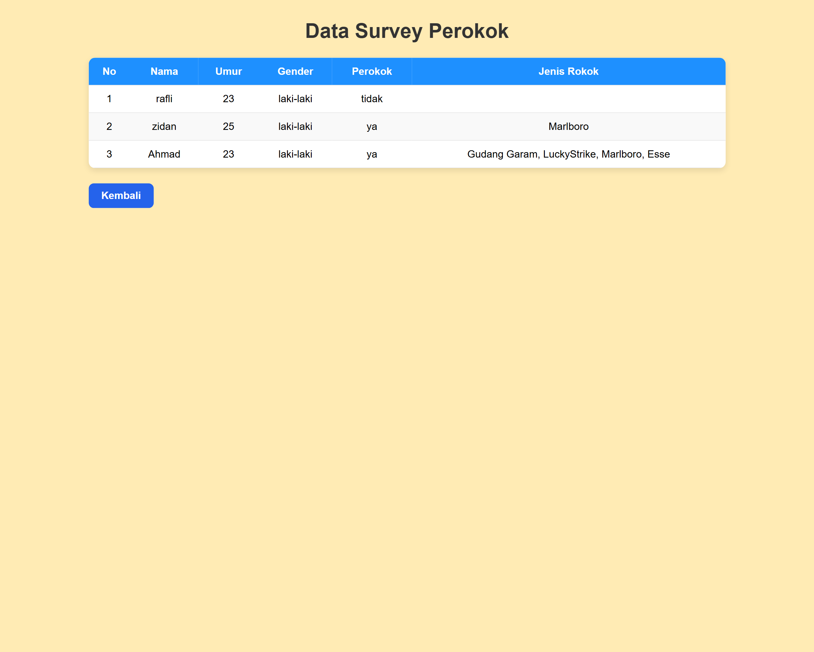

# Layouting Form Survey dengan memanfaatkan sintak CSS

Mengubah form survey yang hanya menggunakan html saja menjadi layout form yang menyerupai contoh dari google form dengan memanfaat CSS yang sudah dipelajari

Contoh Layout Form yang diambil :

Hasil dari Implementasi Layouting dengan CSS 

# Membuat Form Survey dengan Menggunakan Script DOM

## Dengan Menerapkan object element seperti createElement, setAtribute, appendchild, textContent,dan querySelector

Hasil dari program tersebut : 

# Penerapan DOM Local Storage (Browser)

## Menambahkan DOM localStorage dengan mengirim data dari form dan kemudian di ambil data nya untuk ditampilkan ke dalam tabel di halaman yang berbeda.

hasil dari program tersebut :  dan ini ss tabel & local storage :  
