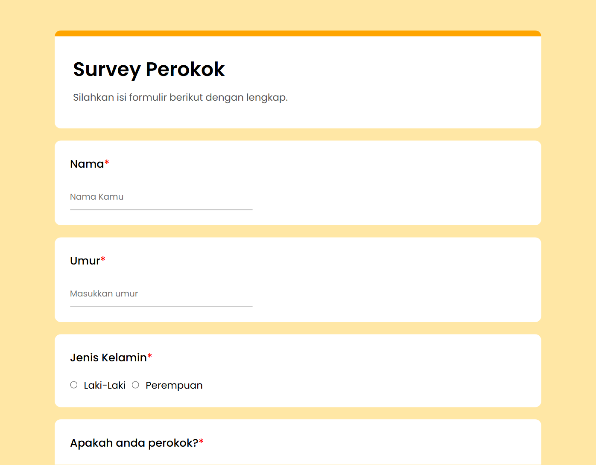

# Membuat Form Survey dengan Menggunakan Script DOM

## Dengan Menerapkan object element seperti createElement, setAtribute, appendchild, textContent,dan querySelector

Hasil dari program tersebut : 
